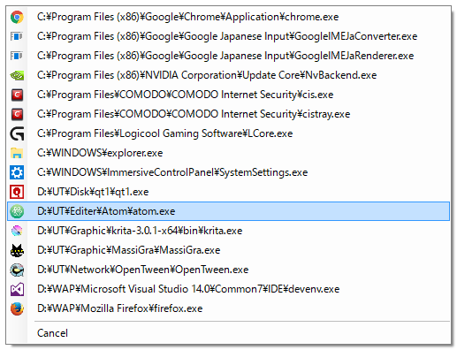

# qt1

「qt0」を模倣した64bit対応のメニュー式タスクマネージャ



## 概要

64bit対応のメニュー式タスクマネージャです。<br>
プロセスの強制終了・再起動・フォルダを開く・任意のアプリケーションに渡すといった操作ができます。<br>
作成にあたっては10年以上愛用している「qt0」を参考にさせていただきました。

## 対応OS

Windows 10 32bit/64bit + .NETFramework v4.5.2

## 機能

- 実行中のプロセスをパス付きでメニューに表示
- パスの一部でインクリメンタルサーチ
- プロセスを強制終了
- プロセスを再起動
- プロセスのフォルダを開く
- 任意のアプリケーションに選択したプロセスのパスを渡して実行

### 独自の機能

- 64bitプロセスの表示
- 重複したプロセスを省略
- 除外ワードを指定して特定のパスを含むプロセスを表示しない(例：system32以下のプロセスなど)

## インストールとアンインストール

ダウンロードした圧縮ファイルを展開して任意の場所にqt1.exeを配置してください。<br>
不要になったらファイルを削除してください。<br>
レジストリは使用していません。

## 使用方法

qt1.exeをドラッグしてタスクバーに追加(ピン留め)するか、愛用のランチャー等に追加して起動してください。<br>
後述する起動オプションで指定していない場合は、マウスの位置にメニューを表示します。

デフォルト設定では以下の通りの動作を行います。
- 左クリック：選択したプロセスを強制終了
- 右クリック：選択したプロセスのフォルダをExplorerで開く
- 中クリック：選択したプロセスを再起動(強制終了した後に起動)

### キーボードでの操作方法
パスの一部を半角英数字(\や.は不可)でインクリメンタルサーチを行うことができます。同じ文字列が複数の項目に含まれる場合は、一番上が選択されます。次の項目を選択したい場合は↓またはTabキーを押すか、別のユニークな文字列を入力し直してください。

Enterが左クリック、Shift+Enterが右クリック、Ctrl+Enterが中クリックに割り当てられています。

### qt1.ini
qt1.exeを初めて起動するとqt1.iniが作成されます。<br>
このファイルを編集することで特定の文字列を含むプロセスを非表示にしたり、クリック時の動作を変更することができます。

| key | Value | 説明 |
| --- | ----- | --- |
|exceptWords|除外ワード,除外ワード|非表示にしたいパスの一部を除外ワードとして指定<br>複数設定したい場合は,で区切る|
|leftClick<br>rightClick<br>middleClick|Terminate<br>Explorer<br>Reboot<br>アプリケーションのパス %D<br>アプリケーションのパス %D\%F|選択したプロセスを強制終了<br>選択したプロセスの親フォルダをExplorerで開く<br>選択したプロセスを再起動(強制終了後に新しく起動)<br>指定したアプリケーションに選択したプロセスの親フォルダを渡す<br>指定したアプリケーションに選択したプロセスのフルパスを渡す|

設定例)
- [system32]と[systemapps]と[common files]を含むプロセスを表示しない
- 左クリック：選択したプロセスを強制終了
- 右クリック：ファイラー(NyanFi)の左ファイルリストに選択したプロセスのフォルダを渡す
- 中クリック：バイナリエディタ(BZ)に選択したプロセスのフルパスを渡す

```
[Settings]
exceptWords=system32,systemapps,common files
leftClick=Terminate
rightClick=C:\nyanfi\NyanFi.exe -L"%D"
middleClick=C:\BZ\Bz.exe "%D\%F"
```

## 起動オプション

- /top=Y メニュー出現位置Y
- /left=X メニュー出現位置X
- /nopathname プロセス表示にパス名を含めずファイル名のみにする
- /noicon アイコン非表示
- EXEのパス EXEが実行しているプロセスを全て強制終了(パスにスペースを含む場合は""で囲む)

## 既知の不具合

なし

## ToDo

- 起動オプションに/rebootを実装

## 実装しなかった機能

- ウインドウタイトルの表示
 - ウインドウタイトルを持たないプロセスをどうするか思いつかない為
 - 重複したプロセスを省略している為

## License

Copyright ©  2016 Kusaka

Licensed under the [MIT](./LICENSE) License.

## Author

[kusaka](https://github.com/kusaka3/)
