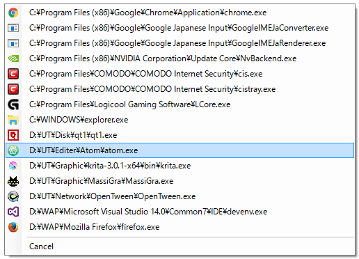

# qt1

「qt0」を模倣した64bitプロセス対応メニュー式タスクマネージャ

## 概要

10年以上愛用している「qt0」が64bit未対応なので、64bitプロセスを表示しつつも「qt0」っぽい動きをするアプリケーションを作りました。.NETFrameworkを使用した簡易版です。

## 対応OS

Windows 10 .NETFramework v4.5.2

## 機能

- プロセスをパス付きでメニューに表示
- パスの一部でインクリメンタルサーチ可能
- 左クリックで強制終了
- 右クリックで親フォルダをExplorerで開く
- [未実装]左・右・中クリック時の動作設定

### 独自の機能

- 64bitアプリケーションを表示
- 重複したプロセスを省略
- 指定ワードを含むプロセスをリストから除外可能(例：system32)

## 使用方法

qt1.exeをドラッグしてタスクバーに追加(ピン留め)するか、愛用のランチャー等に追加して起動してください。

デフォルト設定では、左クリックで強制終了、右と中クリックで選択したプロセスの親フォルダをExplorerで開きます。

キーボードで操作する場合は、\や.を含まない英字パスの一部を入力して項目を選択します。同じ文字が複数の項目に含まれる場合は一番上が選択されていますのでTabキーで次の項目に移動するか、ユニークな文字列を入力し直してください。

Enterが左クリック、Shift+Enterが右クリック、Ctrl+Enterが中クリックに割り当てられています。

### qt1.exe.config
このファイルを編集することで除外ワード指定したりクリック時の動作を変更することができます。

|項目|値(例)|説明|
|-|-|-|
|exceptWords|system32,systemapps,common files|複数指定したい場合は,で区切る|
|leftClick|Terminate(現時点ではこれ以外の値は無視)|左クリック時の動作|
|rightClick|Explorer(またはプロセスの親パスを渡したいプログラム)|右クリックの動作|
|middleClick|同上|中クリック時の動作|

※現時点では細かい設定はできません。

## 起動オプション

- /top=Y メニュー出現位置Y
- /left=X メニュー出現位置X
- /nopathname プロセス表記をパス名ではなくファイル名にする
- /noicon アイコン非表示
- [未実装]EXEのパス EXEが実行しているプロセスを全て強制終了

## 既知の不具合

なし

## ToDo

- 左・中・右クリック時の動作を柔軟に指定できるようにする

## 実装しなかった機能

- ウインドウタイトルの表示
 - ウインドウタイトルを持たないプロセスをどうするか思いつかない為
 - 重複したプロセスを省略している為

## License

Copyright ©  2016 Kusaka

Licensed under the [MIT](./LICENSE) License.

## Author

[kusaka](https://github.com/kusaka3/)
